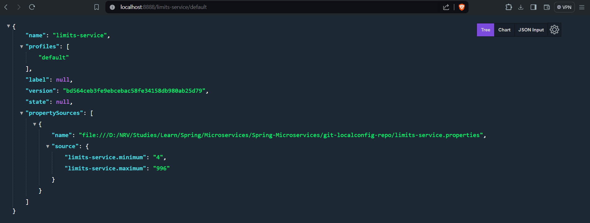

### Introduction to Spring Cloud Config Server

Spring Cloud Config Server provides a centralized configuration service that allows you to manage external properties
for applications across all environments. This is particularly useful in a microservices architecture where multiple
instances of applications require consistent and centralized configuration management.

### Key Features of Spring Cloud Config Server

1. **Centralized Configuration**:
    - Provides a single source of truth for configuration across distributed systems.

2. **Environment-Specific Configurations**:
    - Supports different configurations for different environments (e.g., development, staging, production).

3. **Version Control Integration**:
    - Integrates with Git, SVN, or local file system to manage configurations, providing version control and history.

4. **Dynamic Refresh**:
    - Supports runtime refresh of configurations using Spring Cloud Bus, without needing to restart the applications.

### How Spring Cloud Config Server Works

Spring Cloud Config Server retrieves configuration properties from a centralized source (like a Git repository) and
exposes them via a REST API. Client applications can then fetch these properties from the Config Server at startup or
during runtime.

### Setting Up Spring Cloud Config Server

#### Step 1: Create a Spring Boot Application for Config Server

1. **Add Dependencies**:
    - Add the `spring-cloud-config-server` dependency to your `pom.xml`:

    ```xml
    <dependency>
        <groupId>org.springframework.cloud</groupId>
        <artifactId>spring-cloud-config-server</artifactId>
    </dependency>
    ```

2. **Enable Config Server**:
    - Annotate your main application class with `@EnableConfigServer`:

    ```java
    import org.springframework.boot.SpringApplication;
    import org.springframework.boot.autoconfigure.SpringBootApplication;
    import org.springframework.cloud.config.server.EnableConfigServer;

    @SpringBootApplication
    @EnableConfigServer
    public class ConfigServerApplication {
        public static void main(String[] args) {
            SpringApplication.run(ConfigServerApplication.class, args);
        }
    }
    ```

3. **Configure the Config Server**:
    - Set up the configuration properties in `application.properties` or `application.yml` to point to your
      configuration source (e.g., a Git repository):

    ```properties
    # application.properties
    spring.cloud.config.server.git.uri=file:///D:/NRV/Studies/Learn/Spring/Microservices/Spring-Microservices/git-localconfig-repo
    spring.cloud.config.server.git.clone-on-start=true
    ```

#### Step 2: Create Configuration Files in Your Repository

1. **Organize Configuration Files**:
    - Create configuration files in your Git repository. The file names should follow the
      convention `<application-name>-<profile>.yml` or `<application-name>-<profile>.properties`.

   Example: `limits-service-dev.yml`, `limits-service-prod.yml`

2. **Define Configuration Properties**:
    - Define the configuration properties for different environments within these files.

    ```yaml
    # limits-service-dev.yml
    limits-service:
      minimum: 10
      maximum: 1000
    ```

#### Step 3: Create a Spring Boot Application as Config Client

1. **Add Dependencies**:
    - Add the `spring-cloud-starter-config` dependency to your client application's `pom.xml`:

    ```xml
    <dependency>
        <groupId>org.springframework.cloud</groupId>
        <artifactId>spring-cloud-starter-config</artifactId>
    </dependency>
    ```

2. **Configure the Config Client**:
    - Set up the client application's `application.properties` to connect to the Config Server:

    ```properties
    # application.properties
    spring.application.name=limits-service
    spring.cloud.config.uri=http://localhost:8888
    ```

3. **Use the Configuration Properties**:
    - Use `@ConfigurationProperties` or `@Value` to inject the configuration properties from the Config Server into your
      client application.

    ```java
    @Configuration
    @ConfigurationProperties(prefix = "limits-service")
    public class LimitsConfiguration {
        private int minimum;
        private int maximum;

        // getters and setters
    }
    ```

    ```java
    @RestController
    public class LimitsController {
        @Autowired
        private LimitsConfiguration configuration;

        @GetMapping("/limits")
        public LimitsConfiguration retrieveLimits() {
            return configuration;
        }
    }
    ```

### Advantages of Using Spring Cloud Config Server

1. **Consistency**:
    - Ensures all microservices use the same configuration properties.

2. **Ease of Management**:
    - Centralizes the management of configuration properties, making it easier to update and maintain.

3. **Environment-Specific Configurations**:
    - Allows for easy management of different configurations for different environments (e.g., dev, test, prod).

4. **Security**:
    - Securely manages sensitive configuration data (e.g., credentials) using Spring Cloud Config's support for
      encryption and decryption.

5. **Scalability**:
    - Helps in scaling microservices by providing a centralized configuration management system.
## Once you run the spring-cloud-config-server

This will show that it has been connected with you local git config repo and is able to fetch the value. 
### Conclusion

Spring Cloud Config Server is a powerful tool for managing configuration properties in a microservices architecture. It
provides a centralized, version-controlled, and environment-specific way to manage application configurations, enhancing
consistency, security, and ease of management across distributed systems.